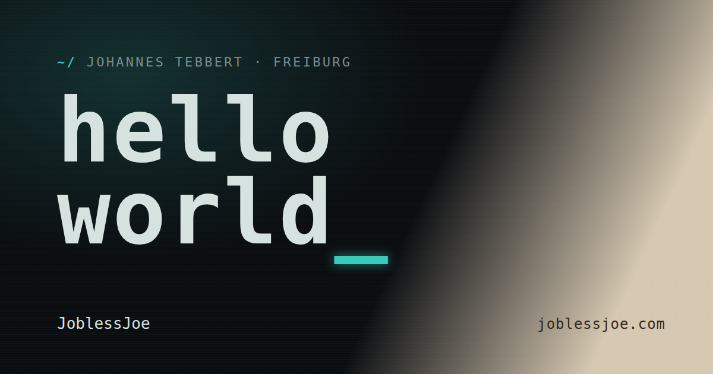
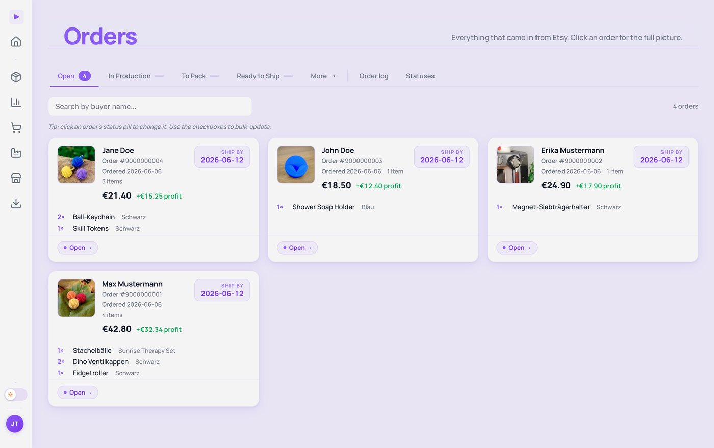
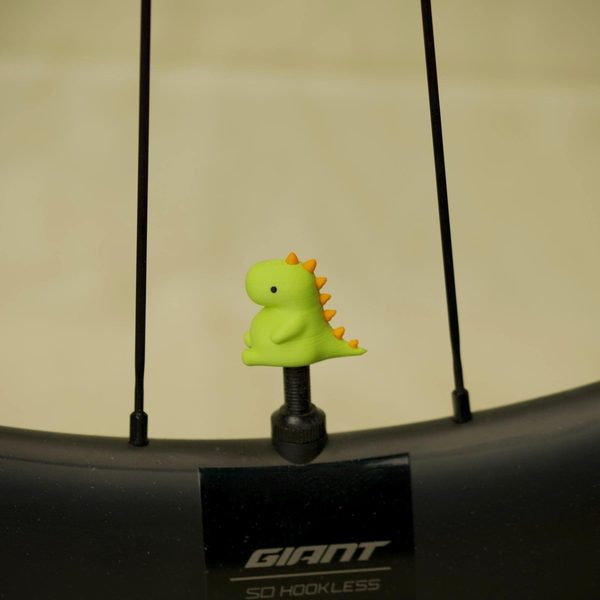

  

  
  
  
  
  

I'm **Johannes Tebbert**, an independent developer in Freiburg. I run a small handmade and
3D-printed shop, and I write the software I need along the way: an inventory & profit tool
for Etsy sellers, browser add-ons, and plugins for AI coding agents running on local LLMs.
Everything I build, I use daily first.

---

## Findig — inventory & profit software for Etsy sellers

I ran an Etsy shop, got overwhelmed, and built the tool I wished existed. Findig syncs Etsy
orders and listings on its own, tracks every variation down to the material, warns before
stock runs out, and shows the profit that's actually left after fees.

**[findig.app](https://findig.app)** · [the story](https://joblessjoe.com/findig)

Node · Express · PostgreSQL · Stripe · Docker — self-hosted behind Caddy and a Cloudflare tunnel, with a warm failover box.

## Open source

Plugins for **Claude Code** and **[DeepSeek Harness](https://github.com/deepseek-ai/deepseek-harness)** (dsh), built for my own
local-LLM setup (Ollama on a Tesla P40). All MIT, zero runtime dependencies.

| Project | What it does |
|---|---|
| **[local&#8209;llm&#8209;worker](https://github.com/JoblessJoe/local-llm-worker)**  Claude Code plugin · MCP server  | Hands the bulk reading — test logs, big files, web pages — to your local LLM, so Claude only gets the answer. ~19,100 tokens read locally, ~130 sent to Claude. |
| **[smart&#8209;compaction](https://github.com/JoblessJoe/smart-compaction)**  dsh plugin  | Lets the model compact its own context at a safe point, instead of being cut off mid-task. |
| **[dsh&#8209;vitals](https://github.com/JoblessJoe/dsh-vitals)**  dsh plugin  | Live CPU, memory, temperature and GPU load, btop-style, inside the dsh web UI. |
| **[kitchenowl&#8209;extension](https://github.com/JoblessJoe/kitchenowl-extension)**  Firefox add-on  | One click saves the recipe you're looking at into your self-hosted KitchenOwl. |

Listed on [awesome-dsh-plugin](https://github.com/awesome-dsh-plugin/awesome-dsh-plugin) and the [official MCP Registry](https://registry.modelcontextprotocol.io). Project pages: [joblessjoe.com/software](https://joblessjoe.com/software)

## Handmade

  
  
  

Handmade & 3D-printed things, made in small batches in Freiburg — on
**[Etsy as itsJoblessJoe](https://itsjoblessjoe.etsy.com)** and on
[eBay](https://www.ebay.de/sch/i.html?_ssn=joblessjoe). The shop is also Findig's proving ground.
More in the [gallery](https://joblessjoe.com/gallery).

---

<a href="https://joblessjoe.com">joblessjoe.com</a> · small software and handmade things from Freiburg

